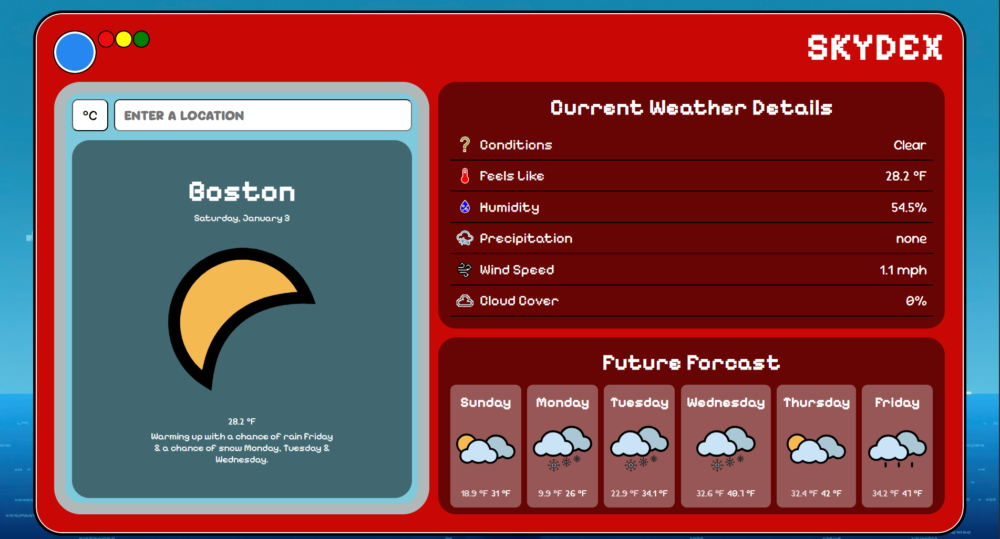

# SkyDex
A weather application inspired by Pokemon's Pokedex built with vanilla JavaScript using the Visual Crossing Weather API

## Features
* 🌍 Current Weather - Search weather for places across the globle
* 🔮 Future Forecasts - Display temperatures and conditions for the next 6 days
* 🌡️ Temperature Metrics - See temperatures in °F or °C
* ⌛ Loading Screen - Simulate the time it takes for the site to fetch the API data
* 📱 Responsive Design - Works on varying device layouts

[Live App](https://andykhandy.github.io/weather_app/)

## Pictures 

## Future ideas to implement
* Add a corresponding Pokemon on the main location weather display
* Create a fluid animated loading screen
